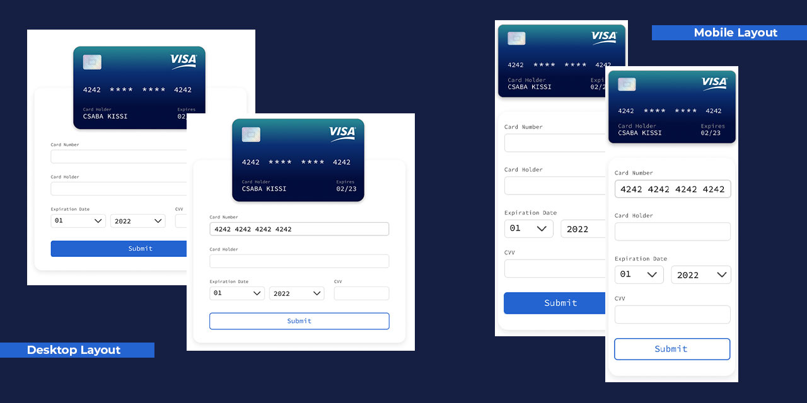

## Table of contents

- [Overview](#overview)
  - [Screenshot](#screenshot)
  - [Links](#links)
- [My process](#my-process)
  - [Built with](#built-with)
  - [What I learned](#what-i-learned)
  - [Continued development](#continued-development)
  - [Author](#author)

## Overview

### The challenge

Users should be able to:

- View the optimal layout depending on their device's screen size
- See hover states for interactive elements

### Screenshot

### Links

- Solution URL: [https://github.com/DevUKay/3-Column-Card.git]
- Live Site URL: [https://devukay.github.io/3-Column-Card/]

## My process

### Built with

- Semantic HTML5 markup
- CSS custom properties
- Flexbox
- CSS Grid
- Mobile-first workflow

### What I learned

Advanced CSS Properties
CSS Grid

To see how you can add code snippets, see below:

### Continued development

I might have not gotten this 100% correct, i am still very new at coding so i intend to keep praticing more as well as learning more proper and advanced ways of writing codes.

## Author

- Twitter - [@kingkayyy](https://twitter.com/kingkayyy)
